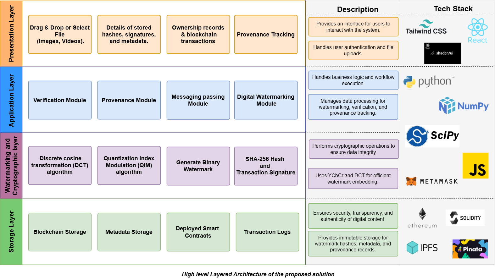
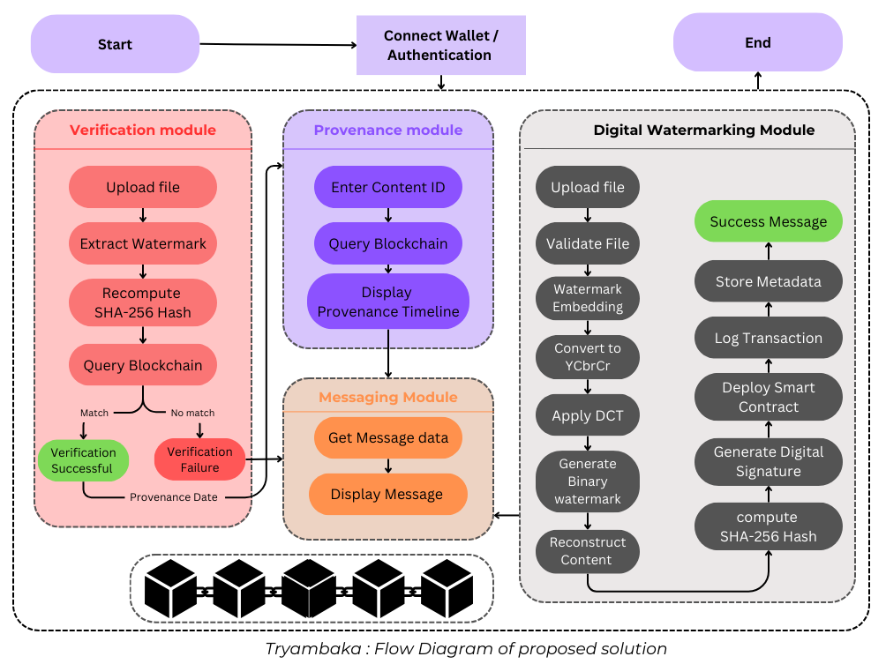
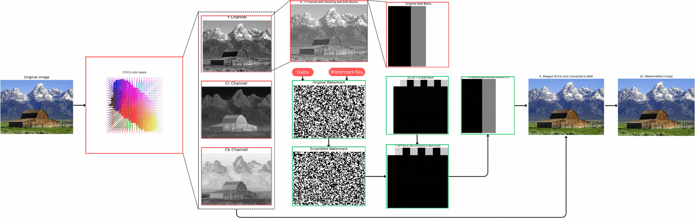

<table align="center">
    <tr>
        <td></td>
        <td><h1>Tryambaka: Blockchain-Powered Watermarking for Digital Content Protection</h1></td>
    </tr>
</table>

## 🌟 Overview

Tryambaka is an advanced **blind watermarking system** integrating **blockchain**, **cryptography**, and **AI** to combat digital content piracy. Using **DCT-QIM watermarking**, cryptographic hashing, and **Ethereum smart contracts**, Tryambaka ensures content authentication, ownership verification, and tamper-proof tracking.

## 🚀 Key Features

| Feature                       | Description                                                                                                      |
| ----------------------------- | ---------------------------------------------------------------------------------------------------------------- |
| 🔒 **Blind Watermarking**     | Uses **Discrete Cosine Transform (DCT)** and **Quantization Index Modulation (QIM)** for invisible watermarking. |
| 🔑 **Cryptographic Security** | Implements **SHA-256 hashing** and **RSA/ECDSA digital signatures** for content verification.                    |
| ⛓ **Blockchain Integration**  | Ethereum smart contracts provide **immutable** ownership tracking and provenance verification.                   |
| 🌍 **Web Interface**          | Built with **React.js, Flask**, and **IPFS** for an intuitive user experience.                                   |

## 🎯 Problem Statement

India ranks **3rd globally** in piracy, with a market loss of **INR 224 billion/year**. Digital piracy affects **artists, filmmakers, and content creators**, making ownership verification and secure distribution crucial.

## 🏗️ Project Architecture



## 🛠 Tech Stack

| Component      | Technology                                 |
| -------------- | ------------------------------------------ |
| **Frontend**   | Next.js, React.js, Tailwind CSS, Web3.js   |
| **Backend**    | Flask, Python, OpenCV, SciPy               |
| **Blockchain** | Ethereum, Solidity, IPFS (Pinata), Web3.py |
| **Security**   | SHA-256, RSA/ECDSA Signatures              |

## 📌 Setup Instructions

### 🔹 Prerequisites

- **Node.js** (v18+), **Python 3.10+**, **Metamask**, **Infura/Alchemy**, **Ganache CLI**

### 🔹 Backend Setup

```bash
cd Triambaka-back
python -m venv venv
source venv/bin/activate  # (Windows: venv\Scripts\activate)
pip install -r requirements.txt
python app.py
```

### 🔹 Frontend Setup

```bash
cd Triambaka-front
npm install
npm run dev
```

### 🔹 Deploy Smart Contracts

```bash
cd SmartContracts
npx hardhat compile
npx hardhat run scripts/deploy.js --network goerli
```

## 🖼️ Diagrams & Flowcharts




## 🔥 Future Enhancements

✅ AI-based forensic analysis  
✅ Decentralized Identity (DID) integration  
✅ Dynamic watermarking for video/audio

## 👥 Team

| Name                |
| ------------------- |
| **M. Kaif Qureshi** |
| **Mohit Patil**     |
| **Sujal Pathrabe**  |
| **Aryan Raje**      |

## 🌍 Links & Resources

- 📄 **Documentation**: [Tryambaka Docs](https://docs.google.com/document/d/16oL_b9KrsuHh8F6_s_no8JNvmkYBxI8j5P_kJTh6naY/edit?usp=sharing)
- 🌐 **Deployed Website**: [Tryambaka Vercel](https://tryambaka-tau.vercel.app/)
- 🎥 **Prototype Video**: [Watch on YouTube](https://youtu.be/7arEKm7g5Uo)

## 📧 Contact Us

For inquiries, reach out to on [LinkedIn](https://www.linkedin.com/in/m-kaif-qureshi/).

---

**Made with ❤️ by Team Hummingbird 🕊️**
